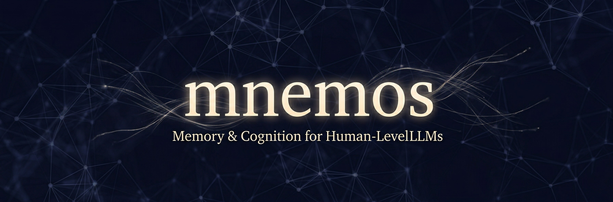
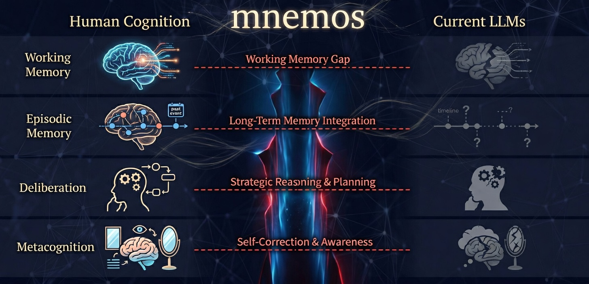
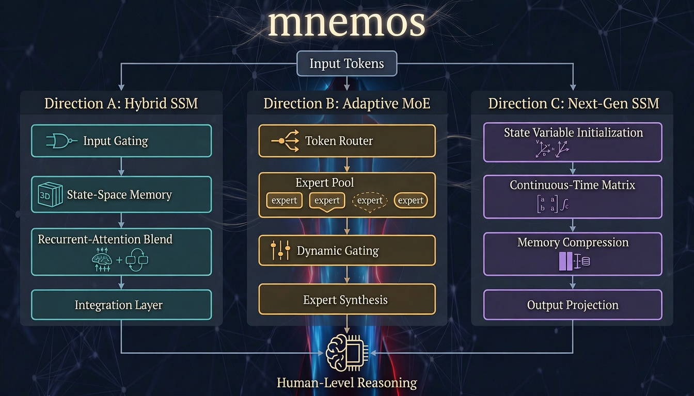
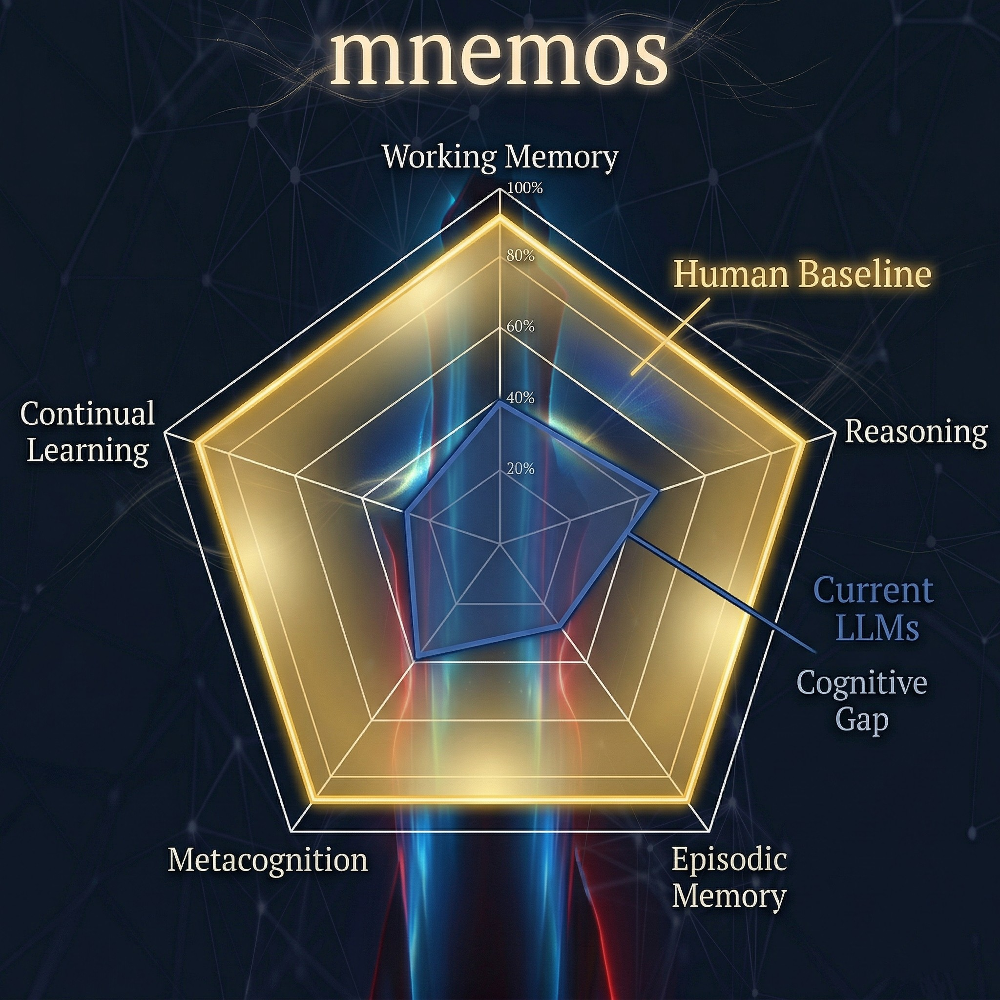

# mnemos

> **Memory & Cognition for Human-Level LLMs** — A research agenda bridging cognitive science and neural architecture design.



[](.)
[](LICENSE)
[](.)
[](.)

---

## Overview

Current large language models achieve remarkable capabilities in pattern recognition and knowledge retrieval, yet remain fundamentally limited by the absence of core cognitive mechanisms that underpin human-level intelligence. This repository documents an active research agenda that:

1. **Surveys** the state of LLM architectures in 2025–2026, including transformers, SSMs, hybrid models, and sparse MoE systems
2. **Analyzes** human cognitive architecture (working memory, episodic memory, metacognition, dual-process reasoning) and maps critical gaps onto current LLM designs
3. **Proposes** three concrete architectural research directions to close those gaps
4. **Defines** quantitative benchmarks grounded in cognitive science for measuring progress toward human-level AI

This is not a single-model release. It is a structured, multi-direction research program with a 12-month roadmap, resource estimates, and measurable success criteria.

---

## The Core Problem

```
Human Cognition          Current LLMs           Gap
─────────────────        ─────────────          ──────────────────────────
Active working memory  → Passive attention    = No manipulation or rehearsal
Persistent episodic    → Context window only  = No cross-session memory
Deliberative reasoning → Single-pass gen.     = No iterative error correction
Metacognitive monitor  → No self-assessment   = Severe hallucination & overconfidence
Continual learning     → Static after train.  = Catastrophic forgetting
```

Scale alone will not fix these gaps. They require **architectural innovation**.



---

## Repository Structure

```
mnemos/
├── docs/
│   ├── plan.md                  # Research agenda & 12-month roadmap
│   └── gap-analysis.md          # Cognitive architecture gap analysis
├── directions/
│   ├── A-hybrid-transformer-ssm/   # Direction A: Hybrid Transformer + SSM
│   ├── B-adaptive-computation/     # Direction B: Adaptive MoE + dynamic depth
│   └── C-next-gen-ssm/            # Direction C: Next-generation SSMs
├── benchmarks/
│   ├── working_memory/          # Digit Span Plus, N-Back, Chunking Efficiency
│   ├── reasoning/               # Multi-step planning, error correction, counterfactuals
│   ├── memory/                  # Episodic recall, semantic integration, source attribution
│   └── metacognition/           # Confidence calibration, error detection, strategy selection
├── baselines/
│   └── README.md                # Baseline model references and reproduction notes
├── images/
│   ├── banner.png               # Repository banner
│   ├── cognitive-gap-map.png    # Human vs LLM cognitive gap overview
│   ├── architecture-overview.png # Three research directions diagram
│   └── benchmark-radar.png      # Benchmark targets radar chart
└── README.md
```

> **Note:** Research is in active progress. Experiment code, model checkpoints, and benchmark implementations will be added as milestones are completed.

---

## Research Directions



### Direction A — Hybrid Transformer-SSM Architectures

**Hypothesis:** Combining transformer attention (global reasoning) with SSM efficiency (linear long-context) achieves an optimal performance/efficiency tradeoff that neither architecture achieves alone.

| Phase | Timeline | Deliverable |
|-------|----------|-------------|
| A1 | Months 1–3 | Literature review, baseline implementations |
| A2 | Months 4–6 | Hybrid block design (attention + Mamba layers) |
| A3 | Months 7–9 | 1B parameter model, pretrained on 1T tokens |
| A4 | Months 10–12 | Benchmark vs. pure transformer/SSM baselines |

**Resources:** 4 FTE · 512 H100 GPU-months · ~$2M compute  
**Risk:** Medium — mixing ratios not yet established by prior work

---

### Direction B — Adaptive Computation Architecture

**Hypothesis:** Input-conditioned dynamic computation (sparse MoE + adaptive depth) can reduce inference cost by 10× without quality degradation.

| Phase | Timeline | Deliverable |
|-------|----------|-------------|
| B1 | Months 1–2 | Survey of MoE routing and adaptive depth methods |
| B2 | Months 3–5 | Novel routing algorithm (load-balanced, stable) |
| B3 | Months 6–9 | 7B MoE model with 64 experts, 4 active per token |
| B4 | Months 10–12 | Evaluation on efficiency/quality Pareto frontier |

**Resources:** 3 FTE · 256 H100 GPU-months · ~$1M compute  
**Risk:** Low-Medium — MoE is proven; novelty lies in routing stability

---

### Direction C — Next-Generation State Space Models

**Hypothesis:** SSMs can match or exceed transformer quality while maintaining linear complexity, enabling million-token context reasoning at scale.

| Phase | Timeline | Deliverable |
|-------|----------|-------------|
| C1 | Months 1–3 | Reproduce Mamba-3B, establish baselines |
| C2 | Months 4–6 | Novel SSM variants (higher-order, multi-input) |
| C3 | Months 7–10 | 3B SSM model with improved language modeling |
| C4 | Months 11–12 | Long-context benchmarks (1M+ tokens) |

**Resources:** 3 FTE · 384 H100 GPU-months · ~$1.5M compute  
**Risk:** High — SSMs are promising but unproven at the largest scales

---

## Cognitive Gap Analysis Summary

Based on our [gap analysis](docs/gap-analysis.md), we classify missing LLM components into two priority tiers:

### P0 — Critical (Must Address for Human-Level Capability)

| Gap | Current State | What's Needed |
|-----|--------------|---------------|
| **Active Working Memory** | Static context window | Manipulable workspace with rehearsal, chunking, selective update/delete |
| **Persistent Episodic Memory** | No cross-session memory | Event encoding, temporal indexing, similarity retrieval, forgetting curves |
| **Deliberative Reasoning** | Single-pass generation | Iterative verify-revise loop, backtracking, error correction |
| **Metacognitive Monitoring** | No self-assessment | Calibrated uncertainty, knowledge boundary detection, strategy selection |

### P1 — Important (Required for Robust Intelligence)

| Gap | Description |
|-----|-------------|
| **Continual Learning** | Online adaptation without catastrophic forgetting |
| **Goal Maintenance** | Persistent goal stack, progress tracking, interruption handling |
| **Explicit World Model** | State representation, dynamics prediction, counterfactual simulation |

---

## Benchmark Targets

We propose concrete, human-grounded benchmarks across four cognitive domains. All targets are set relative to established human baselines from cognitive psychology literature.



### Working Memory
| Benchmark | Human Baseline | LLM Target |
|-----------|---------------|------------|
| Digit Span Plus (manipulation) | 7±2 chunks | Human-equivalent manipulation |
| N-Back with Distraction | 2–3 back | Equivalent robustness under interference |
| Chunking Efficiency | 2–4× with structure | Similar improvement ratio |

### Reasoning
| Benchmark | Human Baseline | LLM Target |
|-----------|---------------|------------|
| Multi-Step Planning (Tower of Hanoi 5+) | ~15 moves, 2–5 min | Equivalent success rate |
| Error Correction Loop | ~80% detection | Equivalent detection rate |
| Counterfactual Reasoning | ~85% coherence | Equivalent consistency |

### Memory
| Benchmark | Human Baseline | LLM Target |
|-----------|---------------|------------|
| Episodic Recall (after delay) | ~70% after 24hr | Equivalent retention curve |
| Semantic Integration (1 week) | ~60% retention | Without catastrophic forgetting |
| Source Attribution | ~75% accuracy | Equivalent source monitoring |

### Metacognition
| Benchmark | Human Baseline | LLM Target |
|-----------|---------------|------------|
| Confidence Calibration | r ≈ 0.3–0.5 | Equivalent or better |
| Error Detection | 60–80% | Equivalent detection rate |
| Strategy Selection | ~70% optimal | Equivalent adaptation |

---

## Overall Success Criteria (Year 1)

| Metric | Target | Stretch Goal |
|--------|--------|--------------|
| Language modeling perplexity | Match Llama-3-8B | Beat Llama-3-70B |
| Inference throughput | 5× transformer baseline | 10× transformer baseline |
| Context window | 256K tokens minimum | 1M+ tokens |
| Training efficiency | 2× tokens/sec vs. transformer | 5× tokens/sec |
| Publications | 3 top-tier papers | 5+ papers, 1 best paper nomination |

---

## Architecture Proposals (Conceptual)

### Working Memory Module (Baddeley-Inspired)

```
┌────────────────────────────────────────┐
│      Central Executive (Controller)    │
├────────────────────────────────────────┤
│  Phonological Loop  │  Visuospatial    │
│  (verbal info)      │  Sketchpad       │
├────────────────────────────────────────┤
│        Episodic Buffer (Integration)   │
└────────────────────────────────────────┘

Implementation: dedicated attention heads per subsystem,
gated read/write, capacity-limited buffers, rehearsal loop
```

### Memory Consolidation System (Hippocampal-Cortical Analog)

```
Encoding → Hippocampal Index → Cortical Storage
               ↓                      ↑
          Sleep Replay ←──────────────┘

Implementation: fast encoding buffer → slow weight consolidation
                replay mechanism + forgetting curve modeling
```

### System 2 Deliberative Module

```
Input → Generate → Verify → [Fail?] → Revise → Output
              ↓          ↑
         Error Check ────┘

Implementation: separate generator + verifier networks,
iterative refinement, confidence-triggered revision
```

---

## Timeline

```
Month  1  2  3  4  5  6  7  8  9  10 11 12
       ├──────────┼────────────┼──────────┤
       Phase 1    Phase 2      Phase 3
       Foundation Development  Validation

Direction A  ████████████████████████████
Direction B  ████████████████████████████
Direction C  ████████████████████████████
             ↑              ↑          ↑
         Team ramp     Mid review   Paper submissions
```

**Year 1 Total Budget: $6.0M**

| Category | Amount |
|----------|--------|
| Compute (H100 cluster) | $3.5M |
| Personnel (10 FTE) | $2.0M |
| Infrastructure & Overhead | $0.5M |

---

## Background & Motivation

The central claim of this research program is that **the path to human-level AI is not purely about scale** — it is about closing specific, well-understood cognitive gaps between current LLM architectures and the human mind.

Key motivations:

- **Quadratic attention complexity** limits long-context reasoning in transformers
- **No persistent memory** means LLMs cannot learn or accumulate experience across interactions
- **Single-pass generation** prevents the iterative error detection humans use naturally
- **Poor metacognition** leads to confident hallucinations and unreliable self-assessment

The cognitive science literature provides a precise roadmap: Baddeley's working memory model, dual-process theory, episodic/semantic memory distinctions, and metacognitive frameworks all offer concrete architectural targets. This research operationalizes that roadmap.

---

## Citation

If you use this research agenda, gap analysis, or benchmark definitions in your work, please cite:

```bibtex
@misc{mnemos-2026,
  title        = {mnemos: Memory \& Cognition for Human-Level LLMs},
  author       = {Head of Research},
  year         = {2026},
  howpublished = {\url{https://github.com/[your-username]/mnemos}},
  note         = {Active research program, 2026}
}
```

---

## Contributing

This is an active internal research program. External collaboration inquiries are welcome — please open an issue describing your interest and relevant background.

For benchmark contributions or reproductions of baseline results, please see `baselines/README.md` (coming soon).

---

## License

MIT License — see [LICENSE](LICENSE) for details.

---

*Research initiated: March 2026 · Status: Active · Venue targets: NeurIPS 2026, ICLR 2027*
